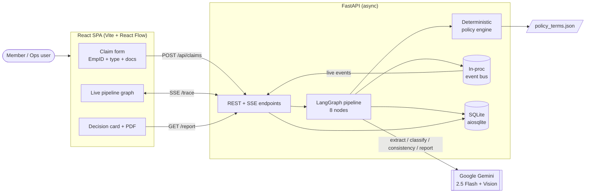
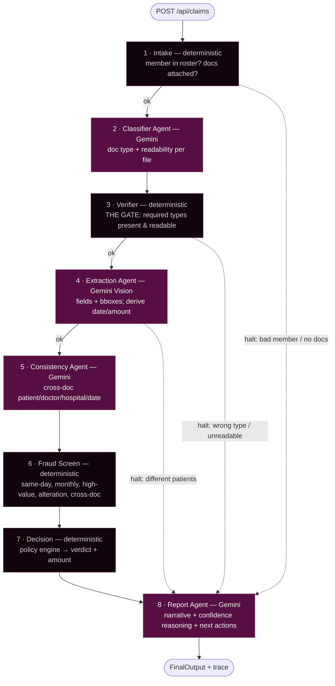
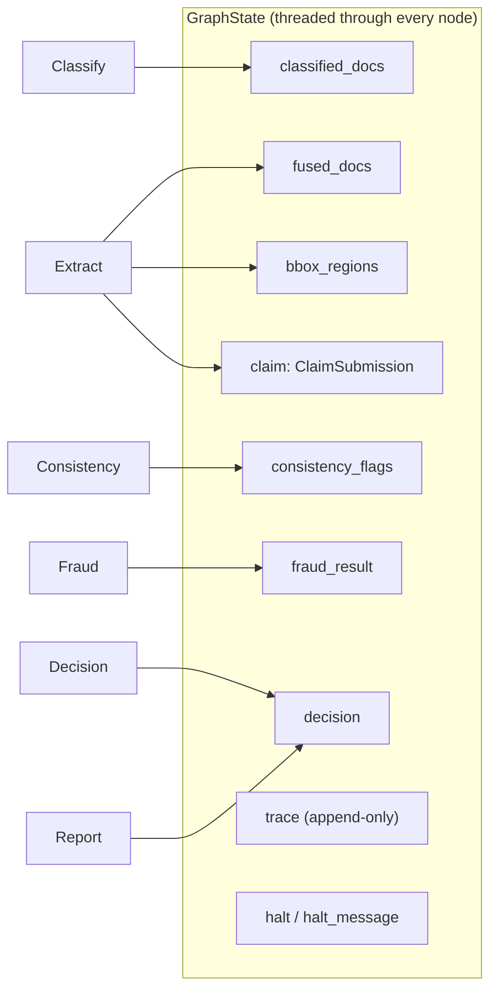
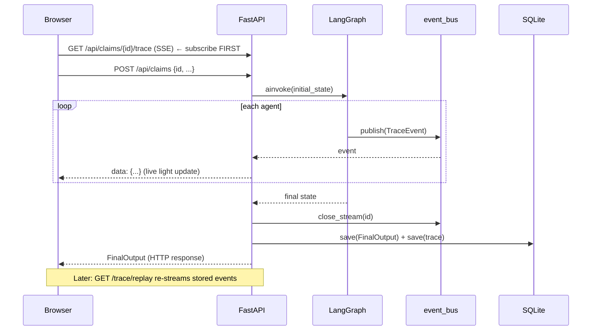
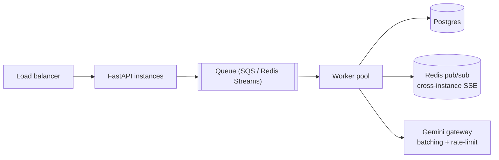

# Architecture — Plum Claims Engine

A multi-agent health-insurance claims processing system. A member submits an
employee ID, claim type, and documents; the system verifies the documents,
extracts structured data with vision LLMs, applies the policy deterministically,
and returns an explainable `APPROVED` / `PARTIAL` / `REJECTED` / `MANUAL_REVIEW`
verdict — with a full, replayable trace of every step.

---

## 1. Design thesis

> **LLMs read. Deterministic code decides. Every step is traced.**

Three principles drive every decision in this system:

1. **LLMs extract, classify, and narrate — they never decide.** The payout
   verdict is produced by a deterministic Python policy engine that reads
   `policy_terms.json`. An LLM hallucination can never change an approved
   amount or invent a coverage rule.
2. **Every agent emits `TraceEvent`s to a shared bus.** The decision is a
   *fold over the trace* — the trace and the verdict can never disagree, which
   is what makes the system auditable (the 20% Observability rubric weight).
3. **Every LLM call has a deterministic fallback.** A Gemini timeout degrades
   confidence and surfaces the failure; it never crashes the pipeline (the
   graceful-degradation requirement, TC011).

---

## 2. System context



The frontend is bundled into FastAPI's static mount, so the whole thing ships
as **one service** (single deploy URL). The browser pre-generates the claim ID
and subscribes to the SSE trace stream *before* POSTing, so agent lights light
up live as each node runs.

---

## 3. The pipeline — 8 agents

A `LangGraph` `StateGraph` threads one `GraphState` (TypedDict) through eight
nodes. Four call Gemini ("Agents"); four are pure deterministic Python.



**Halt routing:** Intake, Verifier, and Extractor can short-circuit by setting
`state["halt"]=True`. Crucially, halts still route through the **Report Agent**,
so even a claim stopped at step 1 gets a human-readable narrative and
next-best-actions — not a bare error.

### Why this split of agents?

| Step | Why it's a separate agent | Why LLM / why not |
|---|---|---|
| **Intake** | Fail structural garbage *before* spending LLM tokens | Deterministic — pure roster/amount check |
| **Classifier** | Document type is needed before we know which fields to extract | LLM — vision needed to read messy Indian docs |
| **Verifier** | "Catch document problems early" is a hard requirement; this is THE GATE | Deterministic — compares classified types to policy `document_requirements` |
| **Extraction** | Turns pixels into structured fields; the most LLM-heavy step | LLM Vision — handwriting, stamps, phone photos |
| **Consistency** | Fraud signal that needs *semantic* matching across docs | LLM — "Rajesh Kumar" ≈ "R. Kumar", "Apollo" ≈ "Apollo BLR" |
| **Fraud Screen** | Policy-driven thresholds must be exact and explainable | Deterministic — counts, thresholds, flags |
| **Decision** | The verdict must be reproducible and never hallucinated | Deterministic — the policy engine |
| **Report** | Explainability layer for ops & member | LLM — rephrases facts, never changes them |

---

## 4. Data flow & state

`GraphState` (`models/graph_state.py`) is the single shared object. Lists use
`operator.add` reducers so each node appends to the trace without clobbering
prior entries.



Two notable data behaviours:

- **Field derivation.** The UI submits only `member_id`, `claim_category`,
  `documents`. The Extraction agent derives `treatment_date` (latest extracted
  document date) and `claimed_amount` (sum of bill totals) and writes them back
  into the claim, so the policy engine sees a complete claim.
- **Bounding boxes inline.** Extraction runs `extract()` and
  `extract_with_bboxes()` in parallel (`asyncio.gather`) and caches regions to
  `{file_id}.regions.json`, so the "view regions" UI never triggers a second
  Gemini round-trip.

---

## 5. Observability — the trace bus



Every `TraceEvent` carries: `agent`, `step_id`, `status` (PASS/FAIL/WARN/SKIP),
`detail`, `rule_reference` (which policy clause), `confidence`, `duration_ms`,
`error`. The trace is persisted, so any past claim can be **replayed** node-by-
node in the UI — the "reconstruct exactly why any claim got any decision"
requirement.

---

## 6. Failure handling

| Failure | Behaviour |
|---|---|
| Gemini timeout / error (classify) | Retries 3× (tenacity backoff), then returns `UNKNOWN`; Verifier emits a readability-specific halt naming the file |
| Gemini timeout / error (extract) | Per-doc try/except → degraded `FusedDoc`, confidence 0, `EXTRACTION_FAILED` flag; pipeline continues |
| Gemini error (consistency / report) | Deterministic / templated fallback; richness lost, correctness kept |
| `simulate_component_failure` (TC011) | Extraction degrades, confidence drops, `component_failures` recorded, `MANUAL_REVIEW` note added — no crash |
| Policy engine raises | Composer catches → safe `MANUAL_REVIEW` fallback decision |
| Any halt | Routed through Report agent so the member still gets a narrative |

Confidence is **reduced**, never faked: degraded extraction caps decision
confidence at `extraction_confidence × 0.85`.

---

## 7. Component contracts (interfaces)

Precise enough to reimplement any single component without reading its code.

| Component | Input | Output | Raises / Failure mode |
|---|---|---|---|
| `intake_node` | `GraphState` | `{intake_ok, halt?, halt_message?, trace}` | never raises; halts on bad member / no docs |
| `classify_node` | `GraphState` | `{classified_docs: [ClassifiedDoc], trace}` | never raises; `UNKNOWN` on Gemini failure |
| `verify_node` | `GraphState` (needs `classified_docs`) | `{verification_ok, halt?, halt_message?, trace}` | never raises; halts on unreadable / wrong / missing type |
| `extract_node` | `GraphState` (needs `classified_docs`) | `{claim, fused_docs:[FusedDoc], bbox_regions, extraction_confidence, failed_components, halt?, trace}` | per-doc errors caught → degraded doc; halts on patient mismatch |
| `consistency_node` | `GraphState` (needs `fused_docs`) | `{consistency_flags:[str], trace}` | never raises; deterministic fallback if LLM down |
| `fraud_node` | `GraphState` | `{fraud_result: FraudResult, trace}` | never raises |
| `compose_node` | `GraphState` | `{decision: Decision, trace}` | catches engine errors → MANUAL_REVIEW |
| `report_node` | `GraphState` (needs `decision`) | `{decision (enriched), trace}` | never raises; templated fallback |
| `evaluate()` (policy engine) | `claim, fused_docs, fraud_result, policy` | `(Decision, [TraceEvent])` | pure function; raises only on corrupt policy |

**Provider contracts** (`app/providers/`), all fail soft:

| Provider | Method | Returns | On failure |
|---|---|---|---|
| `GeminiClassifierProvider` | `classify(file_id, bytes, mime)` | `(DocumentType, confidence, DocumentQuality)` | `(UNKNOWN, 0.30, GOOD)` |
| `GeminiVisionProvider` | `extract(...)` / `extract_with_bboxes(...)` | `ExtractedDoc` / `[region]` | degraded doc / `[]` |
| `GeminiConsistencyProvider` | `check([docs])` | verdict dict | `None` → deterministic fallback |
| `GeminiReportProvider` | `synthesise(...)` | `{narrative, reasoning, actions}` | `None` → templated fallback |

---

## 8. Tech choices & trade-offs

| Decision | Why | Rejected alternative |
|---|---|---|
| **LangGraph** for orchestration | Explicit nodes + conditional halt edges map 1:1 to the agent diagram; state is inspectable | Hand-rolled async chain (less visible flow), CrewAI (heavier, less control) |
| **Deterministic policy engine** | Reproducible, auditable, never hallucinates a payout | LLM-as-judge (unacceptable for money decisions) |
| **Gemini 2.5 Flash** | Strong multilingual vision (Hindi/Tamil + English), cheap, fast | GPT-4V (cost), self-hosted OCR (weak on handwriting/stamps) |
| **SQLite + aiosqlite** | Zero-ops for the assignment scope; async-friendly | Postgres (overkill now — see scaling) |
| **In-process event bus** | Dead-simple live SSE for a single instance | Redis pub/sub (needed at scale, not now) |
| **Single bundled service** | One deploy URL, no CORS/infra friction | Separate FE/BE deploys |
| **3-input form + field derivation** | Members shouldn't hand-type what's already on the bill | Full form (more friction, more error) |

---

## 9. Limitations & scaling to 10×

**Current limitations (honest):**
- Single-process event bus — live SSE only works on one instance.
- SQLite single-writer — fine for demo throughput, not for concurrent load.
- Synchronous Gemini calls within a node — latency bound by the slowest doc.
- Classification quality on poor mock images degrades to `UNKNOWN`; we now halt
  with a readability-specific message rather than a misleading one, but real
  OCR pre-processing (deskew/denoise) would raise the floor.

**At 10× (≈750k claims/yr → millions of lives):**



1. **Decouple submission from processing** — POST enqueues; a worker pool runs
   the graph. Survives Gemini slowness and traffic spikes.
2. **Postgres** for claims + trace (partitioned by month); SQLite → managed DB.
3. **Redis pub/sub** behind the event bus so SSE works across instances.
4. **Gemini gateway** with request batching, a shared rate-limiter, and a
   response cache keyed on file hash (re-submitted docs are free).
5. **Per-category routing** — cheap claims (small consultation) auto-approve on
   a fast path; high-value/fraud-flagged route to a heavier review lane.
6. **Confidence-gated human-in-the-loop** — only `MANUAL_REVIEW` and low-
   confidence claims hit the ops queue, keeping the team sublinear to volume.

---

## 10. Repository map

```
backend/app/
  agents/    intake · classifier · verifier · extractor · consistency · fraud · composer · reporter
  providers/ gemini_vision · gemini_classifier · gemini_consistency · gemini_report
  engine/    policy_engine · policy_loader        # the deterministic core
  api/       routes (upload, SSE, regions) · report (PDF)
  db/        database · repositories · bus         # persistence + event bus
  models/    claim · document · trace · decision · policy · graph_state
  graph.py   main.py   config.py
frontend/src/
  pages/      SubmitPage · HistoryPage
  components/ PipelineGraph · DecisionCard · ClaimForm · TraceLog · DocumentRegionViewer
```

**Test coverage:** 44 tests — policy engine (unit), DB (integration), graph
(end-to-end pipeline), providers (mocked Gemini).
